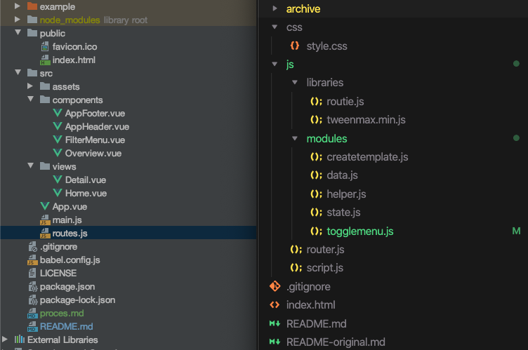

# oba-vue 📚
Vue application with routing for OBA API data. In this assignment I re-made my existing 'Web App From Scratch' application. 
Instead of mostly vanilla javascript, I re-made it using Vue.js. My goal is to learn Vue basics and see what the differences are between mostly Vanilla JS and Vue. Both of them should have their pros & cons.  

## The App 🤓
The app itself like stated before a re-make of an existing Web App From Scratch app. This app will be completely re-written since most of the old code is obsolete.
- Front-end showing actual results
- Using the OBA api to get data
- Mapping API data to desired results
- Being able to filter & sort API data
- Single page web-app with detail pages (routing)
- **Extra: Being able to search every subject you want**


## Why Vue? 🤔
I've seen people on my work use it quite a lot, and I've never really got the hang of it when I tried to learn it a couple of years ago. With some basic javascript knowledge I gained through the minor web development and my work, I am confident to try again and succeed.

It also seemed as a Javascript framework that is more easy to start off with. The syntax is pretty easy to read and it borrows a lot from template engines with it's curly brackets syntax.

## Learning Vue 🧠
As a total n00b in Vue, I needed to start somewhere. It would be hard to compare anything if I didn't even understand the basics to a certain degree. I started a Vue course where I did the first [8 hours](proces.md) of material to get some fundamentals going.

After learning some fundamentals, the most notable difference was the actual structure. Vue seems best when used for 'complete' apps. Bigger or smaller ones like this assignment. This is mostly noticeable when using to `vue-cli`, which enables to create your own `<custom-templates>`. This also makes it very easy to split up your app in different components.

## File Structure 🕌 
In this project I took took it even further by grouping HTML, Javascript & styling per component, instead of splitting this in the project itself. Left is the finished Vue app and on the right is the old WAFS project.



### Code structure 🤖
The basic coding structure is much more layed out in Vue. There are more rules and there are only that many ways to do something. This makes it less free, but also more structured and easier to read when done right. Structure is something you have to do by yourself in Vanilla.

#### Vanilla
Versus vanilla Javascript. The templates and data are defined in a sepperate template file.
```javascript
 menu: function () {
    let template = `
    <div class="filter-menu" >
        ${data}
    </div>
    `
    this.pageContainer.innerHTML += template;
},
```

#### Vue
A simple component in Vue looks like this the code below. Everything is grouped per component. The benefit of this is that I can find everything where I expect it to be.

```html
<template>
    <div id="component">    
        {{ dataObject }}
    </div>
</template>

<script>
    export default {
        props: { ... },
        data: function () {
            return { ... }
        },
        computed: { ... },
    }
</script>

<style>
    body { background-color: black; }
</style>
```

### Templating 👯‍♂️
As shown above. 

#### Vanilla
In vanilla Javascript I have to either write my own template engine, or generate one with `template literals`.

#### Vue
Vue assigns all his magic to an `el: elementWithID`. This makes it possible to use  `{{ curly brackets }}` directly in my HTML templates. Vue is also smart enough to make the data reactive. So, everytime it's changed or updated, it's immediately displayed where it's called.

I learned that I was able to write Vue code directly in my HTML because Vue creates a `virtual dom`. It takes my HTML and turns it into a virtual DOM which is rendered to normal HTML as a result.

The curly brackets are also available to use with `methods` and `computed` properties.

`{{ method() }}` &&h `{{ computedProperty }}`

### Routing 🛩
#### Vanilla
With the `routie` library, setting up a router in vanilla is actually fairly easy. Define the routes and simply call a method when on a specific routes.

In the routes I simply replaced the complete HTML with new HTML, to make it look like it was a completely new page.

```javascript
routie({
    'main': function () {
        createTemplate.overview();
    },

    // Router for the specific pokemon pages
    'pokemon/:id': function (id) {
        createTemplate.page(id);
    }
});
```

#### Vue
In Vue, routing requires a bit more set up. But is still fairly easy when you understand how it works (duh).

Before I was able to use a router, I had to let my app know to actually use it.

```javascript
const router = new VueRouter({
  routes: routes,
});
```

Just like `routie`, you define the routes that you want to use. Including the template you want to use.

```javascript
export const routes = [
    {
        path: '/',
        component: Home,
    },
    {
        path: '/:id',
        name: 'detail',
        component: Detail,
        props: true,
    },
];
```

In my App I can simply say where I want to generate my different routes when they are called, like this:
```
<div id="app"> 
    <router-view :appData="appData" :api="api"></router-view>
</div>
```

### Data objects & variables 🧮
#### Vanilla
In vanilla javascript, using variables is the way to go to store data. You can easily scope variables by placing them in functions, or make the globally available by placing them outside all your functions.

Global variables are a nice way to make data shareable between components.

The downside is that vanilla javascript requires manual set-up

```javascript
var globalData = [];

function() {
    var scopedData = ['Foo'];
}
```

#### Vue
In this vue project I barely used variables. Every component comes with it's own `data` object. All properties, methods, hooks, watchers etc can target `data`. This way you automatically group your functional logic with the template that it's meant for.

It's pretty much the same as the `object-literals` that I use in the WAFS project. The nice thing about Vue components is that everything in `data` is scoped to the component.

```javascript
data: function() {
    return {
        componentData: [],
    }
}
```

It's still pretty easy to share data to child components. You can pass variables and functions through `props` from parent to child.

The downside to this is that you have to pass props again and again for every next child.

### Event listeners
#### Vanilla
In vanilla javascript I have to get an element, add an `eventListener` and THEN I can specify what has to be done when an event is triggered.

```javascript
let button = document.querySelector(selector);
button.addEventListener('click', function () {
    // do stuff
})
```

#### Vue
In Vue, this is a lot easier. Nothing more to say what happens here haha.
```
<button @click="functionName">
```

### Template logic 😎
#### Vanilla
If I want to loop over elements or show elements, I have to loop through an `array` and specify conditions for displaying elements.

```javascript
for (let i = 0; i < pokemon.length; i++) {
    let template = `<div>Nice HTML</div>`;

    this.list.innerHTML += template;
};

if (condition) {
    element.classList.add('show');
}
```

#### Vue
In Vue, loops and conditions can also be defined in the templates themselves. As stated before, all data is available to the whole component. Including it's HTML template. This makes it very very easy to generate content or toggle content.
```html
<li v-for="(result, index) in results" :key="result.id">
    <h2>Nice template here</h2>
</li>

<template v-if="condition">
    <h1>Yes, you may show template here</h1>
</template>
```

## Conclusion
After re-writing everything from scratch. I really had to get used to the fixed structure that Vue brings to the table.

The biggest difference is that it's structure mostly component dependant. Which is a strength and can be a weakness if not used correctly. Since it's easy to lose track of what is connected to each other when linking data between components. Plus-side is that even then, every component has it's own data objects and methods. Even when refactoring code, components are more independent.

A components link between it's template and data makes it very much fun to use. It's easy to read and all the data is reactive. Especially because you can simply use HTML. This makes it very easy to start off with when learning Vue.

I cannot say I completely mastered Vue. There are still a lot of things that I don't completely get. Like how to structure your components the best way, using global states & functions, the list goes on & on. BUT I do achieved my goal of having a basic understanding of the language. And I'm happy with the result.

## Project setup
```
npm install
```

### Compiles and hot-reloads for development
```
npm run serve
```

### Compiles and minifies for production
```
npm run build
```

### Lints and fixes files
```
npm run lint
```
